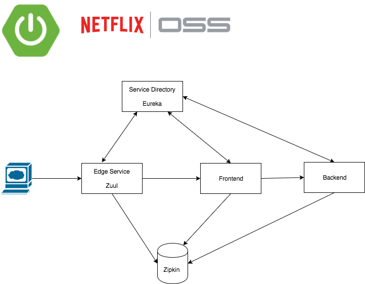

# Spring Cloud Demo

This is a spring cloud Demo Project with Zuul, Eureka, Ribbon, Sleuth &amp; Zipkin. 

# Intro

When you are migrating to a microservice environment you are getting a lot of beneftis and on the other side you need to tackle new challenges.

- How can you find all service instances that are up and running?
- What if a service won't respond? How do you handle load balancing between the available instances?
- Services won't respond successfully or even throw errors. Can you provide a sane fallback for the user?
- How to debug and analyze issues in your distributed production enivornment? Why was the call so slow? Where did the error happen? 

# Deployment

Using [docker-compose](docker-compose.yml) or [kubernetes](provision/kubernetes).

# Components

## Infrastructure

### [configserver](configserver/README.md)

The configuration server uses the [spring-cloud-netflix-demo-config](https://github.com/marcopaga/spring-cloud-netflix-demo-config/)-git repository.
Now you can cahnge the configuration in the git repository and the properties will be forwarded to the running instances. You need to make the context refreshable via @RefreshScope.

### [eureka](eureka/README.md)

This is the distributed service directory. All services will register with eureka.

### [edgeservice](edgeservice/README.md)

This service is using zuul as the gateway to our microservices. All requests to our application pass this central instance.
Here you can process the requests in multiple ways.
Be advised that zuul is deprecated and will be replaced by [Spring cloud gateway](http://cloud.spring.io/spring-cloud-gateway/) which will be based on Project Reactor.

## Business Services

### [backend](backend/README.md)

This is a simple demo application which can perform a simple calculation. The operation is available via a REST interface.

### [frontend](frontend/README.md)

This application will use the backend to perform a calculation. The backend will be called with a simple RestTemplate.
The call is carried out with ribbon which uses eureka to discover the backend insances.

# Distributed Tracing

All components include [Sleuth](http://cloud.spring.io/spring-cloud-static/spring-cloud-sleuth/1.2.5.RELEASE/single/spring-cloud-sleuth.html#_terminology) that provides tracing information for all requests. The meta data will be transferred between the services.
The demo project uses [Zipkin](http://zipkin.io/) to show the tracing information.
If you are using the ELK Stack you are also covered. Have a look [here](http://cloud.spring.io/spring-cloud-static/spring-cloud-sleuth/1.2.5.RELEASE/single/spring-cloud-sleuth.html#_log_correlation) to find the details. 

# Running

Prepare the Spring Boot Apps with Maven. In order to start the apps you need create the jar-Files.

> mvn clean install 

Start the applications with Docker Compose.

> docker-compose up -d

Have a look at the [configuration](docker-compose.yml).

# Using

You need to give the whole stack some time to find the available services in eureka.

## Sample call:

[localhost:8080/frontend/](http://localhost:8080/frontend/)

## Zipkin:

[localhost:9411](http://localhost:9411/)

## Eureka:

[localhost:8761](http://localhost:8761/)

## Config Server:

[localhost:8888](http://localhost:8888/)

# License

